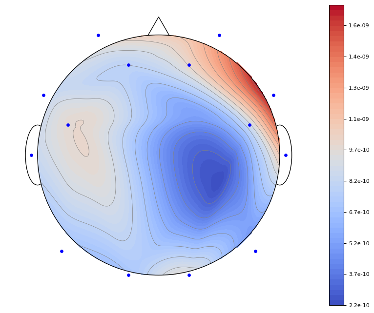

# EEG-processing-python

## EEG Topograph 

### Dependencies
1. numpy (`pip install numpy`)
2. scipy (`pip install scipy`)
3. matplotlib (`pip install matplotlib`)
4. mne (optional) (`pip install mne`): Only for read EDF file 

### Usage
Input: data- 1D array 14 power values 
       ax- Matplotlib subplot object to be plotted every thing
       fig- Matplot lib figure object to draw colormap

Output: matplotlib axis

Code:
```python
if __name__ == "__main__":
    import mne
    import matplotlib.pyplot as plt 

    data = mne.io.read_raw_edf('1.edf')
    raw_data = data.get_data()
    ch_data = raw_data[2:16,:]
    pwrs, _ = get_psds(ch_data)

    fig, ax = plt.subplots(figsize=(10,8))
    plot_topomap(pwrs, ax, fig)
    plt.show()
    fig.savefig("topograph.png", bbox_inches='tight')
```

Output image:



To download sample EDF dataset please refer [Person identification from EEG using various machine learning techniques with inter-hemispheric amplitude ratio](https://doi.org/10.1371/journal.pone.0238872)
