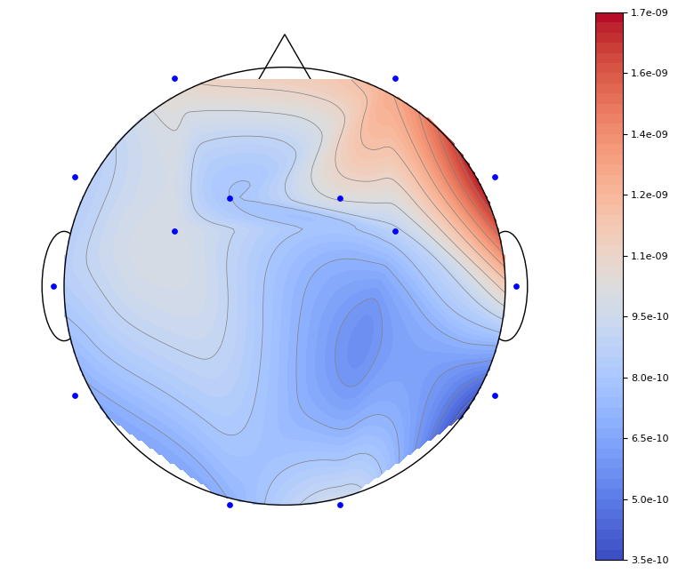
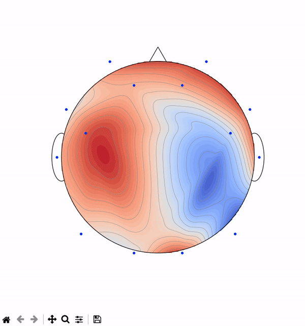

# EEG-processing-python

Comprehensive tools for EEG data visualization and topographic mapping using the standard 10-5 electrode system.

## EEG Topograph 

This package provides tools to visualize EEG data in topographic maps with proper electrode positioning, channel labeling, and interpolation to fill the entire head circle.

### Features

- Accurately maps EEG channel data using the standard 10-5 system electrode coordinates
- Intelligently fills the entire head circle with multi-pass interpolation
- Displays clean, transparent channel labels
- Supports multiple input formats and channel configurations
- Provides both static visualization and animation capabilities

### Dependencies

1. numpy (`pip install numpy`)
2. scipy (`pip install scipy`)
3. matplotlib (`pip install matplotlib`)
4. mne (`pip install mne`): For reading EDF files and processing EEG data

### Installation

```bash
# Clone the repository
git clone https://github.com/yourusername/EEG-processing-python.git
cd EEG-processing-python

# Install dependencies
pip install numpy scipy matplotlib mne
```

### Usage

The package provides multiple ways to visualize EEG data:

1. **Command-line interface** via `topograph.py`
2. **Static visualization** via `static_visualization_test.py` 
3. **Animated visualization** via `animation_test.py`

#### Command-line Usage

The main script `topograph.py` provides a command-line interface for EEG topographic visualization:

```bash
python topograph.py [edf_file] [options]
```

**Options:**
- `--indices [index1,index2,...]`: Specify specific channel indices to use
- `--channels [ch1,ch2,...]`: Specify specific channel names to use
- `--prefix`: Auto-detect channels starting with common EEG prefixes (F, C, P, O, T, etc.)
- `--output, -o [filename]`: Specify output image filename

**Examples:**
```bash
# Basic usage with default settings
python topograph.py 1.edf

# Specify channel names
python topograph.py 1.edf --channels F3,F4,C3,C4,P3,P4

# Auto-detect channels and save to specific file
python topograph.py 1.edf --prefix --output my_topograph.png
```

#### Static Visualization

Code (static_visualization_test.py):
```python
import mne
import matplotlib.pyplot as plt 
from topograph import get_psds, plot_topomap


data = mne.io.read_raw_edf('1.edf')
raw_data = data.get_data()
ch_data = raw_data[2:16,:]
pwrs, _ = get_psds(ch_data)

fig, ax = plt.subplots(figsize=(10,8))
plot_topomap(pwrs, ax, fig)
plt.show()
fig.savefig("topograph.png", bbox_inches='tight')
```

Output image:



#### Animation Visualization

The `animation_test.py` script provides animated topographic visualizations showing how EEG patterns change over time:

```bash
python animation_test.py [edf_file] [options]
```

**Options:**
- `--frames [number]`: Number of frames in the animation (default: 50)
- `--interval [ms]`: Interval between frames in milliseconds (default: 100)
- `--save`: Save the animation as a GIF
- `--output, -o [filename]`: Specify output GIF filename
- `--channels [index1,index2,...]`: Comma-separated list of channel indices to use

**Examples:**
```bash
# Basic animation with default settings
python animation_test.py 1.edf

# Create smoother animation with more frames
python animation_test.py 1.edf --frames 100 --interval 50

# Save animation to a GIF file
python animation_test.py 1.edf --save --output my_eeg_animation.gif

# Use specific channels
python animation_test.py 1.edf --channels 3,4,5,6,7,8
```

Output example:



### Channel Location System

The package uses the standard 10-5 electrode placement system to accurately map EEG channels. The electrode positions are provided in `eeg_channel_locator.py`, which includes:

- Midline electrodes (Fpz, Fz, Cz, Pz, etc.)
- Left hemisphere electrodes (Fp1, F3, C3, P3, etc.)
- Right hemisphere electrodes (Fp2, F4, C4, P4, etc.)
- Additional positions for higher density EEG

### Data Sources

To download sample EDF dataset please refer to:
[Person identification from EEG using various machine learning techniques with inter-hemispheric amplitude ratio](https://doi.org/10.1371/journal.pone.0238872)

### API Reference

#### `plot_topomap(data, ax, fig, channel_labels=None, draw_cbar=True, title=None)`

Creates a topographic plot of EEG data.

**Parameters:**
- `data`: 1D array of values for each channel
- `ax`: Matplotlib subplot object
- `fig`: Matplotlib figure object
- `channel_labels`: List of EEG channel labels
- `draw_cbar`: Whether to visualize colorbar (boolean)
- `title`: Optional title for the plot

**Returns:**
- `ax`: The matplotlib axis object
- `cbar`: The colorbar object (if created)

#### `get_psds(data, fs=128, f_range=[0.5, 30])`

Calculates signal power using Welch method.

**Parameters:**
- `data`: mxn matrix (m: number of channels, n: samples of signals)
- `fs`: Sampling frequency (default 128Hz)
- `f_range`: Frequency range (default 0.5Hz to 30Hz)

**Returns:**
- `powers`: Power values for each channel
- `psds`: Power spectral density values
